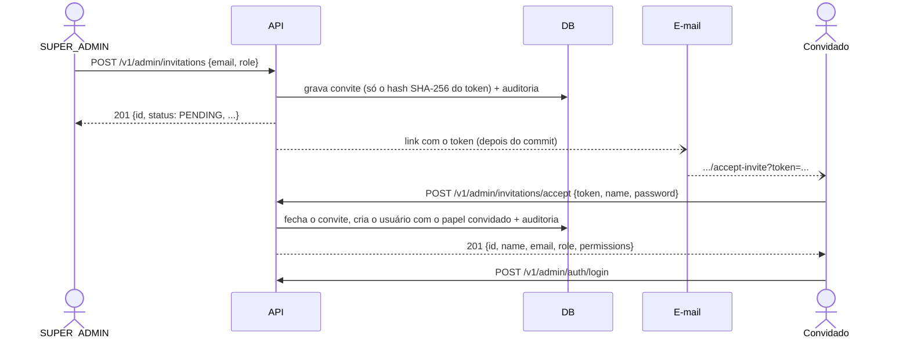

# Autenticação (JWT)

[← Voltar ao README](../README.md)

Registro, login, refresh de token rotativo, papéis e rotas públicas/protegidas.

JWT stateless (sem sessão), com refresh token rotativo persistido (hash, nunca em texto puro) — reutilizar um refresh token já trocado é rejeitado.

```bash
# registrar (sempre cria role CLIENT)
curl -X POST localhost:8080/v1/auth/register \
  -H "Content-Type: application/json" \
  -d '{"email": "diego@example.com", "password": "s3cret-password", "name": "Diego Ferreira"}'

# login -> { accessToken, refreshToken }
curl -X POST localhost:8080/v1/auth/login \
  -H "Content-Type: application/json" \
  -d '{"email": "diego@example.com", "password": "s3cret-password"}'

# usar o accessToken nas rotas protegidas
curl -X POST localhost:8080/v1/bookings \
  -H "Content-Type: application/json" \
  -H "Authorization: Bearer <accessToken>" \
  -d '{"bookableId": 1}'

# trocar o refreshToken por um par novo (o antigo é revogado no ato)
curl -X POST localhost:8080/v1/auth/refresh \
  -H "Content-Type: application/json" \
  -d '{"refreshToken": "<refreshToken>"}'

# perfil do usuário autenticado
curl localhost:8080/v1/users/me -H "Authorization: Bearer <accessToken>"

# atualizar o próprio nome
curl -X PATCH localhost:8080/v1/users/me \
  -H "Content-Type: application/json" \
  -H "Authorization: Bearer <accessToken>" \
  -d '{"name": "Novo Nome"}'
```

Rotas públicas: `/health`, `/auth/register|login|refresh`, `/admin/auth/login|refresh|logout`, `/admin/invitations/accept`, `/flights/search`, `/flights/lowest-price`, `/destinations`, `/bookables/*/seats`, Swagger. Todo o resto exige `Authorization: Bearer <token>` — inclusive `/users/me` (GET e PATCH).

## Papéis e permissões

Quem pode **fazer** o quê é uma **permissão**, nunca um nome de papel: cada endpoint administrativo declara `@PreAuthorize("hasAuthority('FLIGHT_WRITE')")`, e a tabela abaixo (só no domínio, `Role.permissions`) diz quais papéis a têm. O token carrega apenas o nome do papel, então mudar a tabela não exige reemitir token.

| Papel | Permissões |
|---|---|
| `CLIENT` | nenhuma (usa só a API pública e a própria conta) |
| `SUPPORT` | `ADMIN_PORTAL_ACCESS`, `CUSTOMER_READ`, `CUSTOMER_NOTE`, `CUSTOMER_BLOCK`, `BOOKING_READ_ANY`, `BOOKING_CANCEL_ANY`, `PAYMENT_REFUND`, `REVIEW_MODERATE`, `DASHBOARD_READ` |
| `CATALOG_MANAGER` | `ADMIN_PORTAL_ACCESS`, `FLIGHT_READ`, `FLIGHT_WRITE`, `CATALOG_WRITE`, `PROMO_WRITE`, `DASHBOARD_READ` |
| `SUPER_ADMIN` | todas (inclui `CUSTOMER_EXPORT`, `CUSTOMER_ERASE`, `AUDIT_READ`, `ADMIN_MANAGE`) |

`ADMIN_PORTAL_ACCESS` é o que faz um papel ser "staff": o `SecurityConfig` a exige em tudo sob `/v1/admin/**`, e cada endpoint pede a sua permissão específica por cima. Uma regra do ArchUnit (`EveryAdminEndpointDeclaresItsPermissionTest`) reprova o build se um endpoint `/admin` esquecer o `@PreAuthorize`.

**Papel e status em `/v1/admin/**` vêm do banco**, a cada requisição, e não do token: quem é bloqueado ou rebaixado perde o acesso na chamada seguinte. Fora do admin, o token de um cliente vale até vencer (15 minutos) — trade-off aceito para não consultar o banco em toda requisição.

Não existe endpoint que promova um **cliente** a staff (permitiria escalar privilégio pela API): a equipe nasce de um [convite](#equipe-convite-e-gestão) e o primeiro `SUPER_ADMIN` do [bootstrap](#primeiro-super_admin-bootstrap). Só para testar localmente ainda dá para promover direto no banco:

```sql
UPDATE app_user SET role = 'SUPER_ADMIN' WHERE email = 'diego@example.com';
```

## Conta bloqueada

`app_user.status` é `ACTIVE` ou `BLOCKED` (com motivo e momento obrigatórios, garantido por `CHECK` no banco). Conta bloqueada **não faz login nem renova a sessão**: `403` com `code=ACCOUNT_BLOCKED`. Isso só é dito depois de a senha estar certa, para quem chuta senhas não descobrir quais contas existem. Bloquear pelo `BlockUserUseCase` também revoga todos os refresh tokens do usuário, na mesma transação.

O `User` tem `@Version` (lock otimista) e o último acesso é gravado por um `UPDATE` direto, justamente para uma cópia velha do usuário nunca desfazer um bloqueio.

## Limite de tentativas de login

Contador de **falhas** no Redis (compartilhado entre instâncias, expira sozinho em 15 minutos), por **e-mail** (5) e por **IP** (20). Estourou: `429` com `Retry-After` e `code=TOO_MANY_ATTEMPTS`, mesmo com a senha certa. Acertar a senha zera o contador do e-mail. Se o Redis cair, o limitador deixa passar (e registra um aviso) em vez de derrubar o login. Um e-mail inexistente executa uma verificação de senha do mesmo custo, para o tempo de resposta não revelar quais e-mails existem. Valores em `login-attempts.*` (`application.yml`).

Métrica: `dbook.auth.login{outcome=success|invalid_credentials|blocked|rate_limited, audience=client|staff}`.

## Política de senha

Mínimo de **8** caracteres para cliente (**12** para a equipe), no máximo 72 **bytes** (o BCrypt ignora o que passa disso), diferente do e-mail e fora de uma lista de senhas comuns. Sem regra de composição (NIST 800-63B). Viola: `400` com `code=VALIDATION_FAILED`.

## Portal administrativo: sessão

O portal usa três rotas abertas, porque são elas que criam a sessão. O token de acesso volta no corpo (o portal o guarda só em memória); o de renovação vai **só num cookie** `httpOnly; Secure; SameSite=Strict; Path=/v1/admin/auth`, que scripts não leem. `refresh` e `logout` só aceitam o `Origin` do portal (lista `cors.allowed-origins`).

```bash
# login: só staff entra; credencial de cliente recebe o mesmo 401 de uma senha errada
curl -i -X POST localhost:8080/v1/admin/auth/login \
  -H "Content-Type: application/json" \
  -d '{"email": "diego@example.com", "password": "s3cret-password"}'
# -> 200 {"accessToken": "..."} + Set-Cookie: dbook_admin_refresh=...

# renovar (gira o cookie; precisa do Origin do portal)
curl -i -X POST localhost:8080/v1/admin/auth/refresh \
  -H "Origin: http://localhost:3000" --cookie "dbook_admin_refresh=<valor>"

# quem sou eu e o que posso fazer (o portal monta o menu a partir de `permissions`)
curl localhost:8080/v1/admin/auth/me -H "Authorization: Bearer <accessToken>"

# sair: revoga o token e apaga o cookie (204)
curl -i -X POST localhost:8080/v1/admin/auth/logout \
  -H "Origin: http://localhost:3000" --cookie "dbook_admin_refresh=<valor>"
```

`Secure` faz o navegador só enviar o cookie por HTTPS. O Chrome trata `http://localhost` como seguro; o Safari não — rodando local no Safari, use `ADMIN_PORTAL_COOKIE_SECURE=false`.

## Equipe: convite e gestão

Quem tem `ADMIN_MANAGE` (só o `SUPER_ADMIN`) convida pessoas por e-mail; **nenhuma senha trafega por e-mail** — o convidado escolhe a própria ao aceitar.



- **Token:** 256 bits aleatórios (`SecureRandom`), válido por **72 horas** e de **uso único**. No banco só existe o hash; o token em claro vive apenas no e-mail. Por isso "reenviar" gera um **link novo** (o antigo para de funcionar).
- **Um convite aberto por e-mail** (índice único parcial). Convidar de novo o mesmo endereço **revoga** o anterior. Endereço que já tem conta (em qualquer caixa, `Maria@x.com` = `maria@x.com`) é `409`.
- **Um erro só** para token desconhecido, expirado, usado ou revogado: `400` com `code=INVALID_INVITATION`. Quem chuta tokens não descobre o estado de nenhum. Senha fraca é `400 VALIDATION_FAILED` e **não gasta** o convite.
- O e-mail sai **depois do commit**: se a transação desfizer, nenhum link sai para um convite que não existe. Falha no envio não desfaz o convite (é registrada e dá para reenviar). Hoje o único `EmailSender` é o `LoggingEmailSender`, que **só registra o envio** no log; o corpo (com o link) só entra no log com `EMAIL_LOG_BODY=true` e nunca com o perfil `json`. O adaptador SES vem no M36.
- **Gestão:** `GET /v1/admin/staff`, `PATCH /v1/admin/staff/{id}/role`, `POST .../block` e `.../unblock`. Regras: ninguém altera o **próprio** papel nem se bloqueia (`409`); o sistema **nunca fica sem `SUPER_ADMIN` ativo** (as linhas dos `SUPER_ADMIN` ativos são travadas com `SELECT ... FOR UPDATE`, em ordem de id, antes de contar — dois rebaixamentos simultâneos não deixam zero); trocar o papel ou bloquear **encerra as sessões** da pessoa; o id de um **cliente** nas rotas da equipe é `404`, igual a um id inexistente. Toda ação é auditada (`STAFF_INVITED`, `STAFF_INVITATION_RESENT`, `STAFF_INVITATION_REVOKED`, `STAFF_INVITATION_ACCEPTED`, `STAFF_ROLE_CHANGED`, `STAFF_BLOCKED`, `STAFF_UNBLOCKED`); o "antes/depois" do convite **não leva o e-mail**.

## Primeiro SUPER_ADMIN (bootstrap)

Alguém tem de convidar o primeiro. Na subida, `BootstrapSuperAdminRunner` lê `DBOOK_BOOTSTRAP_ADMIN_EMAIL` e `DBOOK_BOOTSTRAP_ADMIN_PASSWORD` e cria um `SUPER_ADMIN` **somente se não existir nenhum** (idempotente: pode ficar configurado). As duas vazias: nada acontece. **Só uma** das duas: a aplicação **não sobe** (configuração pela metade nunca passa em silêncio). E-mail que já é conta de cliente também derruba a subida, em vez de promover um cliente. A senha segue a política da equipe (12+). Em produção a senha viria do Secrets Manager (M43); nunca existe endpoint para isso.

## Trocar a própria senha

`POST /v1/admin/auth/change-password` `{currentPassword, newPassword}` → `204`. Exige a senha atual, e uma senha atual errada conta no **mesmo limite** do login (`429` depois de 5) — um token de acesso roubado não vira um jeito de adivinhar a senha. Trocar com sucesso **encerra todas as sessões** (refresh tokens revogados): é preciso entrar de novo. A nova segue a política (12+ para staff).

## Modelo de ameaças (convites)

| Ameaça | Mitigação |
|---|---|
| **Token vazado** (e-mail lido, backup do banco) | só o hash fica no banco; 256 bits, 72 h, uso único; o `SUPER_ADMIN` pode revogar; reenviar invalida o link anterior |
| **Convite reutilizado** (aceito duas vezes, ao mesmo tempo) | o convite é fechado **antes** de criar o usuário, com `@Version`: o segundo aceite perde a disputa (`409`) sem criar uma segunda conta |
| **Enumeração** (descobrir quem é convidado ou cliente) | erro idêntico para qualquer token inválido; id de cliente nas rotas da equipe = `404`; o aceite não consulta e-mail algum antes de validar o token |
| **Escalada de privilégio** | só `ADMIN_MANAGE` convida, muda papel ou bloqueia; papel do convite tem de ser staff; ninguém mexe no próprio papel; não existe rota que promova um cliente |
| **Lockout** (ficar sem administrador) | trava das linhas dos `SUPER_ADMIN` ativos + contagem; bootstrap por ambiente |
| **Senha fraca ou vazada em log** | política de 12+ para staff; o corpo do e-mail não vai ao log em produção; a auditoria não guarda e-mail |
| **Força bruta no aceite** | token de 256 bits (inviável); **sem limite por IP** de propósito, para não bloquear convidados legítimos atrás do mesmo NAT |

## Erros: o campo `code`

Todo erro sai como `{"error": "<mensagem>", "code": "<CODIGO>"}`. App e portal decidem o que mostrar pelo `code`, nunca pela mensagem. Lista em [Endpoints](endpoints.md#formato-de-erro).
