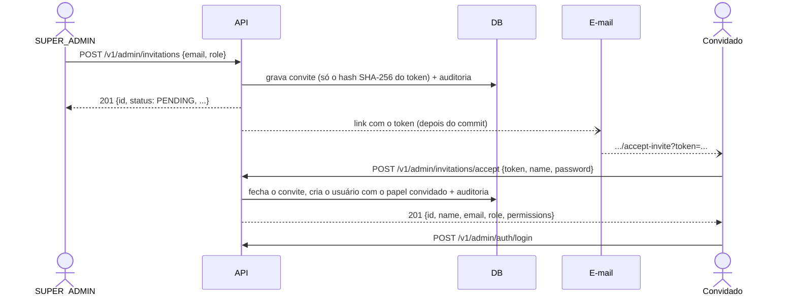

# Autenticação (JWT)

[← Voltar ao README](../README.md)

Registro, login, refresh de token rotativo, papéis e rotas públicas/protegidas.

JWT stateless (sem sessão), com refresh token rotativo persistido (hash, nunca em texto puro) — reutilizar um refresh token já trocado é rejeitado.

```bash
# registrar (sempre cria role CLIENT)
curl -X POST localhost:8080/v1/auth/register \
  -H "Content-Type: application/json" \
  -d '{"email": "diego@example.com", "password": "s3cret-password", "name": "Diego Ferreira"}'

# login -> { accessToken, refreshToken }
curl -X POST localhost:8080/v1/auth/login \
  -H "Content-Type: application/json" \
  -d '{"email": "diego@example.com", "password": "s3cret-password"}'

# usar o accessToken nas rotas protegidas
curl -X POST localhost:8080/v1/bookings \
  -H "Content-Type: application/json" \
  -H "Authorization: Bearer <accessToken>" \
  -d '{"bookableId": 1}'

# trocar o refreshToken por um par novo (o antigo é revogado no ato)
curl -X POST localhost:8080/v1/auth/refresh \
  -H "Content-Type: application/json" \
  -d '{"refreshToken": "<refreshToken>"}'

# perfil do usuário autenticado
curl localhost:8080/v1/users/me -H "Authorization: Bearer <accessToken>"

# atualizar o próprio nome
curl -X PATCH localhost:8080/v1/users/me \
  -H "Content-Type: application/json" \
  -H "Authorization: Bearer <accessToken>" \
  -d '{"name": "Novo Nome"}'
```

## Perfil, preferências e sessões do cliente (M51)

Tudo em `/v1/users/me`, sempre do próprio chamador (`currentUserId()`, nunca um id no corpo):

| Endpoint | O que faz |
|---|---|
| `GET` e `PATCH /v1/users/me` | perfil e nome; a resposta traz `createdAt` ("membro desde") e `avatarUrl` |
| `PUT` e `DELETE /v1/users/me/avatar` | foto por URL `https` (até 500 caracteres) |
| `GET` e `PUT /v1/users/me/preferences` | idioma, tema, aeroporto de origem, país, moeda, classe, assento, formato de data e unidade; o `PUT` substitui o conjunto, `null` é "sem escolha", valor fora da lista é `400` |
| `POST /v1/users/me/password` | troca a senha (política do cliente, 8+) e encerra todas as sessões; a senha atual errada conta no limite de login |
| `GET /v1/users/me/sessions`, `DELETE /v1/users/me/sessions/{id}` | aparelhos com sessão aberta (uma por família de refresh token) e encerramento de um; de outro usuário é `404` |

A foto e as preferências ficam em `user_profile` (1:1, criada na primeira mudança); a anonimização da conta apaga a linha e a exportação dos dados a inclui.

Rotas públicas: `/health`, `/auth/register|login|refresh`, `/admin/auth/login|refresh|logout`, `/admin/invitations/accept`, `/flights/search`, `/flights/lowest-price`, `/destinations`, `/bookables/*/seats`, Swagger. Todo o resto exige `Authorization: Bearer <token>` — inclusive `/users/me` (GET e PATCH).

## Papéis e permissões

Quem pode **fazer** o quê é uma **permissão**, nunca um nome de papel: cada endpoint administrativo declara `@PreAuthorize("hasAuthority('FLIGHT_WRITE')")`, e a tabela abaixo (só no domínio, `Role.permissions`) diz quais papéis a têm. O token carrega apenas o nome do papel, então mudar a tabela não exige reemitir token.

| Papel | Permissões |
|---|---|
| `CLIENT` | nenhuma (usa só a API pública e a própria conta) |
| `SUPPORT` | `ADMIN_PORTAL_ACCESS`, `CUSTOMER_READ`, `CUSTOMER_NOTE`, `CUSTOMER_BLOCK`, `BOOKING_READ_ANY`, `BOOKING_CANCEL_ANY`, `PAYMENT_REFUND`, `REVIEW_MODERATE`, `DASHBOARD_READ` |
| `CATALOG_MANAGER` | `ADMIN_PORTAL_ACCESS`, `FLIGHT_READ`, `FLIGHT_WRITE`, `CATALOG_WRITE`, `PROMO_WRITE`, `DASHBOARD_READ` |
| `SUPER_ADMIN` | todas (inclui `CUSTOMER_EXPORT`, `CUSTOMER_ERASE`, `AUDIT_READ`, `ADMIN_MANAGE`) |

`ADMIN_PORTAL_ACCESS` é o que faz um papel ser "staff": o `SecurityConfig` a exige em tudo sob `/v1/admin/**`, e cada endpoint pede a sua permissão específica por cima. Uma regra do ArchUnit (`EveryAdminEndpointDeclaresItsPermissionTest`) reprova o build se um endpoint `/admin` esquecer o `@PreAuthorize`.

**Papel e status em `/v1/admin/**` vêm do banco**, a cada requisição, e não do token: quem é bloqueado ou rebaixado perde o acesso na chamada seguinte. Fora do admin, o token de um cliente vale até vencer (15 minutos) — trade-off aceito para não consultar o banco em toda requisição.

Não existe endpoint que promova um **cliente** a staff (permitiria escalar privilégio pela API): a equipe nasce de um [convite](#equipe-convite-e-gestão) e o primeiro `SUPER_ADMIN` do [bootstrap](#primeiro-super_admin-bootstrap). Só para testar localmente ainda dá para promover direto no banco:

```sql
UPDATE app_user SET role = 'SUPER_ADMIN' WHERE email = 'diego@example.com';
```

## Conta bloqueada

`app_user.status` é `ACTIVE` ou `BLOCKED` (com motivo e momento obrigatórios, garantido por `CHECK` no banco). Conta bloqueada **não faz login nem renova a sessão**: `403` com `code=ACCOUNT_BLOCKED`. Isso só é dito depois de a senha estar certa, para quem chuta senhas não descobrir quais contas existem. Bloquear pelo `BlockUserUseCase` também revoga todos os refresh tokens do usuário, na mesma transação.

O `User` tem `@Version` (lock otimista) e o último acesso é gravado por um `UPDATE` direto, justamente para uma cópia velha do usuário nunca desfazer um bloqueio.

## Limite de tentativas de login

Contador de **falhas** no Redis (compartilhado entre instâncias, expira sozinho em 15 minutos), por **e-mail** (5) e por **IP** (20). Estourou: `429` com `Retry-After` e `code=TOO_MANY_ATTEMPTS`, mesmo com a senha certa. Acertar a senha zera o contador do e-mail. Se o Redis cair, o limitador deixa passar (e registra um aviso) em vez de derrubar o login. Um e-mail inexistente executa uma verificação de senha do mesmo custo, para o tempo de resposta não revelar quais e-mails existem. Valores em `login-attempts.*` (`application.yml`).

Métrica: `dbook.auth.login{outcome=success|invalid_credentials|blocked|rate_limited, audience=client|staff}`.

## Refresh token: família e reuso

Todo login abre uma **família** de refresh tokens (`family_id`); cada renovação gasta o token e emite o próximo na mesma família. A troca é um `UPDATE` condicional (gastar o token e perceber que já estava gasto são a mesma operação), então dois refreshes simultâneos com o mesmo token têm um só vencedor. Apresentar um token **já gasto** é sinal de roubo (o ladrão ou o dono está usando uma cópia velha): a família inteira é revogada, quem tinha o último token precisa entrar de novo, e a métrica `dbook.auth.refresh{outcome=reuse_detected}` conta o caso.

## Chave de assinatura e rotação

O token leva o `kid` da chave que o assinou. `jwt-keys.active-key-id` diz qual assina; `jwt-keys.retired` (id → segredo em Base64) guarda as aposentadas, que **só verificam**. Um token sem `kid` (emitido antes da rotação existir) é verificado pela chave `legacy`, se configurada, senão pela ativa. O procedimento passo a passo está em [seguranca.md](seguranca.md#rotacionar-a-chave-do-jwt).

## Segundo fator para a equipe (TOTP)

Um aplicativo autenticador (Google Authenticator, 1Password, Authy...) gera um código de 6 dígitos a cada 30 segundos a partir de um segredo que só ele e o servidor têm (RFC 6238: HMAC-SHA1 do passo de tempo). Quem rouba a senha da equipe não entra sem o telefone.

**Como o segredo é guardado.** Cifrado com AES-256-GCM (da JVM; autenticada: um valor alterado não decifra) com a chave de `totp.encryption-key` (Secrets Manager em produção, nunca no repositório), com um IV aleatório por valor e o prefixo `v1:` para uma troca futura de chave. O banco nunca vê o segredo em claro. Os **códigos de recuperação** (10, `XXXXX-XXXXX`, ~50 bits cada) são mostrados **uma vez** e só o *hash* fica guardado.

**O desenho do login em duas etapas** (`POST /v1/admin/auth/login`):

| Situação da conta | Resposta |
|---|---|
| sem segundo fator e o papel não o exige | `200` com a sessão, como sempre |
| com o segundo fator ligado | `202 {challengeToken, enrollmentRequired: false}`, **sem sessão e sem cookie** |
| sem segundo fator e o papel o exige (`admin.two-factor.required-roles`, `SUPER_ADMIN` em produção) | `202 {challengeToken, enrollmentRequired: true}`: a conta só entra depois de cadastrar o autenticador |

O `challengeToken` é um JWT de **5 minutos** que só prova "a senha estava certa" e diz o que vem a seguir (`use=2fa-verify` ou `2fa-enroll`): não abre nenhum endpoint (o filtro só aceita `use=access`). Com ele:

- `POST /v1/admin/auth/2fa/verify {challengeToken, code}`: o código de 6 dígitos **ou um código de recuperação** → `200` com a sessão e o cookie.
- `POST /v1/admin/auth/2fa/enroll {challengeToken}` → `{otpauthUri, manualEntryKey}` (o URI vira o QR; a chave é para digitar à mão) e `POST /v1/admin/auth/2fa/confirm {challengeToken, code}` → a sessão **e os códigos de recuperação**, uma vez.

**Quem já está logado** liga e desliga o segundo fator da própria conta em `POST /v1/admin/2fa/enroll`, `/confirm {code}` (devolve os 10 códigos) e `/disable {password, code}` (pede a senha **e** um código: uma sessão roubada sozinha não o desliga; recusado, `409`, para o papel que o exige). `GET /v1/admin/auth/me` diz `twoFactorEnabled` e `twoFactorRequired`.

**O que protege cada código:**

- **Uso único.** O passo de tempo do último código aceito (`last_used_step`) é gravado por um `UPDATE ... WHERE last_used_step < :passo`, cujo número de linhas é a decisão: dois pedidos com o mesmo código, só um passa; um código visto por cima do ombro não serve de novo, nem um mais antigo. Vale o passo atual **e um de cada lado** (relógios que se desencontram).
- **Tentativas limitadas.** Os erros contam num limite próprio (por conta, 5 por 15 minutos, e por IP), o mesmo limitador do login, então 6 dígitos não se adivinham com calma (`429`).
- **Código de recuperação** gasto por um `UPDATE ... WHERE used_at IS NULL`: vale uma vez.
- **Um código errado é `400 INVALID_TWO_FACTOR_CODE`**, não 401: o pedido é que está errado, a sessão não, e um cliente não deve confundi-lo com um login que expirou.

**A porta dos fundos fechada.** O `POST /v1/auth/login` (o do cliente) aceita qualquer papel com a senha certa, e o token que ele devolve abre `/v1/admin/**` do mesmo jeito: sem cuidado, seria um caminho em volta do segundo passo. Por isso uma conta de **equipe** com o segundo fator ligado **ou** de um papel que o exige é recusada nesse endpoint com `403 TWO_FACTOR_REQUIRED`. Cliente e equipe sem segundo fator (e sem exigência) entram como antes.

**Quem perde o telefone e os códigos:** outro `SUPER_ADMIN` chama `POST /v1/admin/staff/{id}/2fa/reset {reason}` (`ADMIN_MANAGE`, motivo de ao menos 10 caracteres): remove o segundo fator e **encerra as sessões** da pessoa, auditado como `TWO_FACTOR_RESET` com o motivo. Ninguém reseta a própria conta (seria a porta que o segundo fator fecha) e o `404` esconde quem é cliente.

**O tipo de cada token (`use`).** Junto com o desafio nasceu um achado: o token de acesso e o de renovação tinham o mesmo formato, então o de renovação (7 dias) abriria qualquer endpoint como se fosse de acesso. Agora cada token leva `use` (`access`, `refresh`, `2fa-verify`, `2fa-enroll`) e só `access` abre endpoint. Um token sem `use` (emitido antes disso) vale como de acesso até o último expirar.

Configuração: `admin.two-factor.required-roles` (`ADMIN_2FA_REQUIRED_ROLES`, vazio no desenvolvimento local, `SUPER_ADMIN` na Terraform), `admin.two-factor.issuer` (o nome que o aplicativo mostra) e `totp.encryption-key` (`TOTP_ENCRYPTION_KEY`).

## Custo do BCrypt

`security.bcrypt-strength` (padrão **12**; os testes usam 4 para ficarem rápidos). O custo vai dentro do próprio *hash*: subir o valor não invalida nenhuma senha existente, as novas é que usam o custo novo.

## Recuperação de conta: e-mail confirmado e senha esquecida

Dois fluxos que usam o mesmo mecanismo: um **link de uso único** mandado por e-mail. O token é aleatório (256 bits, o mesmo gerador do convite), e o banco guarda **só o hash**: uma cópia do banco não contém nenhum link utilizável. A tabela é `account_token` (`purpose`, `expires_at`, `used_at`); gastar um link é um `UPDATE ... WHERE used_at IS NULL AND expires_at > agora`, então dois pedidos com o mesmo link só deixam um passar. Pedir um link novo **fecha os anteriores** do mesmo tipo.

**Confirmar o e-mail** (validade de **48 horas**)
- O cadastro cria a conta como não confirmada (`emailVerified: false` em `POST /v1/auth/register` e `GET /v1/users/me`) e manda o link depois do *commit* (uma transação desfeita não manda nada).
- `POST /v1/auth/verify-email {token}` → `204`; `400 INVALID_ACCOUNT_TOKEN` para link desconhecido, vencido, já usado ou de outro tipo (o mesmo erro para todos: quem chama não aprende nada sobre o estado do link).
- `POST /v1/auth/resend-verification` (cliente logado) → `204` com um link novo; `409` se já confirmou; limitado a poucas vezes por janela (`429`).
- **A política:** com `account.require-verified-email` ligada (`ACCOUNT_REQUIRE_VERIFIED_EMAIL`; **desligada** no desenvolvimento local, **ligada** na Terraform), `POST /v1/bookings`, `POST /v1/accommodations/*/bookings` e `POST /v1/payments` respondem `403 EMAIL_NOT_VERIFIED` até confirmar. Olhar, buscar, favoritar e o perfil continuam abertos. A checagem lê o banco a cada um desses POSTs, então confirmar vale **na hora, com a mesma sessão**.
- **Quem já nasce confirmado:** a equipe que aceita um convite (o link do convite foi para esse endereço), o primeiro `SUPER_ADMIN` do bootstrap, e **as contas que já existiam** quando a V48 rodou (pedir a todo cliente atual que confirme um endereço que funciona o trancaria fora; a migration marca todos como confirmados).

**Senha esquecida** (validade de **1 hora**)
- `POST /v1/auth/forgot-password {email}` → **sempre `202`**, com o mesmo corpo exista a conta ou não. O e-mail sai **em outra *thread*** (`mailExecutor`), para que a demora da resposta também não diga quem tem conta. Conta bloqueada ou anonimizada não recebe nada. Cliente recebe o link do app, equipe o do portal.
- O pedido conta contra um limite próprio (por e-mail digitado, exista ou não, e por IP, o mesmo limitador do login: `429`).
- `POST /v1/auth/reset-password {token, newPassword}` → `204`. A senha segue a política (8 para cliente, 12 para equipe); **uma senha fraca não gasta o link** (`400 VALIDATION_FAILED` e o link continua valendo). Ao escolher a nova senha: **todas as sessões da conta terminam** (quem tinha a senha antiga ou uma sessão roubada sai), o contador de falhas de login é zerado (quem se trancou fora entra de novo) e o e-mail passa a contar como confirmado (o link provou a caixa de entrada). O segundo fator da equipe **continua exigido** no próximo login.

Os links apontam para `customer-app.base-url` (`CUSTOMER_APP_BASE_URL`; o app precisa servir `/verify-email` e `/reset-password`) e `admin-portal.base-url` (o portal serve `/reset-password`). Em produção os e-mails só chegam de verdade quando o adaptador do SES existir; até lá o `LoggingEmailSender` escreve o e-mail (e o link) no log.

## Política de senha

Mínimo de **8** caracteres para cliente (**12** para a equipe), no máximo 72 **bytes** (o BCrypt ignora o que passa disso), diferente do e-mail e fora de uma lista de senhas comuns. Sem regra de composição (NIST 800-63B). Viola: `400` com `code=VALIDATION_FAILED`.

## Portal administrativo: sessão

O portal usa três rotas abertas, porque são elas que criam a sessão. O token de acesso volta no corpo (o portal o guarda só em memória); o de renovação vai **só num cookie** `httpOnly; Secure; SameSite=Strict; Path=/v1/admin/auth`, que scripts não leem. `refresh` e `logout` só aceitam o `Origin` do portal (lista `cors.allowed-origins`).

```bash
# login: só staff entra; credencial de cliente recebe o mesmo 401 de uma senha errada
curl -i -X POST localhost:8080/v1/admin/auth/login \
  -H "Content-Type: application/json" \
  -d '{"email": "diego@example.com", "password": "s3cret-password"}'
# -> 200 {"accessToken": "..."} + Set-Cookie: dbook_admin_refresh=...

# renovar (gira o cookie; precisa do Origin do portal)
curl -i -X POST localhost:8080/v1/admin/auth/refresh \
  -H "Origin: http://localhost:3000" --cookie "dbook_admin_refresh=<valor>"

# quem sou eu e o que posso fazer (o portal monta o menu a partir de `permissions`)
curl localhost:8080/v1/admin/auth/me -H "Authorization: Bearer <accessToken>"

# sair: revoga o token e apaga o cookie (204)
curl -i -X POST localhost:8080/v1/admin/auth/logout \
  -H "Origin: http://localhost:3000" --cookie "dbook_admin_refresh=<valor>"
```

`Secure` faz o navegador só enviar o cookie por HTTPS. O Chrome trata `http://localhost` como seguro; o Safari não — rodando local no Safari, use `ADMIN_PORTAL_COOKIE_SECURE=false`.

## Equipe: convite e gestão

Quem tem `ADMIN_MANAGE` (só o `SUPER_ADMIN`) convida pessoas por e-mail; **nenhuma senha trafega por e-mail** — o convidado escolhe a própria ao aceitar.



- **Token:** 256 bits aleatórios (`SecureRandom`), válido por **72 horas** e de **uso único**. No banco só existe o hash; o token em claro vive apenas no e-mail. Por isso "reenviar" gera um **link novo** (o antigo para de funcionar).
- **Um convite aberto por e-mail** (índice único parcial). Convidar de novo o mesmo endereço **revoga** o anterior. Endereço que já tem conta (em qualquer caixa, `Maria@x.com` = `maria@x.com`) é `409`.
- **Um erro só** para token desconhecido, expirado, usado ou revogado: `400` com `code=INVALID_INVITATION`. Quem chuta tokens não descobre o estado de nenhum. Senha fraca é `400 VALIDATION_FAILED` e **não gasta** o convite.
- O e-mail sai **depois do commit**: se a transação desfizer, nenhum link sai para um convite que não existe. Falha no envio não desfaz o convite (é registrada e dá para reenviar). Hoje o único `EmailSender` é o `LoggingEmailSender`, que **só registra o envio** no log; o corpo (com o link) só entra no log com `EMAIL_LOG_BODY=true` e nunca com o perfil `json`. O adaptador SES vem no M36.
- **Gestão:** `GET /v1/admin/staff`, `PATCH /v1/admin/staff/{id}/role`, `POST .../block` e `.../unblock`. Regras: ninguém altera o **próprio** papel nem se bloqueia (`409`); o sistema **nunca fica sem `SUPER_ADMIN` ativo** (as linhas dos `SUPER_ADMIN` ativos são travadas com `SELECT ... FOR UPDATE`, em ordem de id, antes de contar — dois rebaixamentos simultâneos não deixam zero); trocar o papel ou bloquear **encerra as sessões** da pessoa; o id de um **cliente** nas rotas da equipe é `404`, igual a um id inexistente. Toda ação é auditada (`STAFF_INVITED`, `STAFF_INVITATION_RESENT`, `STAFF_INVITATION_REVOKED`, `STAFF_INVITATION_ACCEPTED`, `STAFF_ROLE_CHANGED`, `STAFF_BLOCKED`, `STAFF_UNBLOCKED`); o "antes/depois" do convite **não leva o e-mail**.

## Primeiro SUPER_ADMIN (bootstrap)

Alguém tem de convidar o primeiro. Na subida, `BootstrapSuperAdminRunner` lê `DBOOK_BOOTSTRAP_ADMIN_EMAIL` e `DBOOK_BOOTSTRAP_ADMIN_PASSWORD` e cria um `SUPER_ADMIN` **somente se não existir nenhum** (idempotente: pode ficar configurado). As duas vazias: nada acontece. **Só uma** das duas: a aplicação **não sobe** (configuração pela metade nunca passa em silêncio). E-mail que já é conta de cliente também derruba a subida, em vez de promover um cliente. A senha segue a política da equipe (12+). Em produção a senha viria do Secrets Manager (M43); nunca existe endpoint para isso.

## Trocar a própria senha

`POST /v1/admin/auth/change-password` `{currentPassword, newPassword}` → `204`. Exige a senha atual, e uma senha atual errada conta no **mesmo limite** do login (`429` depois de 5) — um token de acesso roubado não vira um jeito de adivinhar a senha. Trocar com sucesso **encerra todas as sessões** (refresh tokens revogados): é preciso entrar de novo. A nova segue a política (12+ para staff).

**E-mail de conta anonimizada não é aceito no registro** (`409 CONFLICT`, igual a "já existe"): ver [CRM](crm.md#anonimizar-direito-ao-esquecimento).

## Modelo de ameaças (convites)

| Ameaça | Mitigação |
|---|---|
| **Token vazado** (e-mail lido, backup do banco) | só o hash fica no banco; 256 bits, 72 h, uso único; o `SUPER_ADMIN` pode revogar; reenviar invalida o link anterior |
| **Convite reutilizado** (aceito duas vezes, ao mesmo tempo) | o convite é fechado **antes** de criar o usuário, com `@Version`: o segundo aceite perde a disputa (`409`) sem criar uma segunda conta |
| **Enumeração** (descobrir quem é convidado ou cliente) | erro idêntico para qualquer token inválido; id de cliente nas rotas da equipe = `404`; o aceite não consulta e-mail algum antes de validar o token |
| **Escalada de privilégio** | só `ADMIN_MANAGE` convida, muda papel ou bloqueia; papel do convite tem de ser staff; ninguém mexe no próprio papel; não existe rota que promova um cliente |
| **Lockout** (ficar sem administrador) | trava das linhas dos `SUPER_ADMIN` ativos + contagem; bootstrap por ambiente |
| **Senha fraca ou vazada em log** | política de 12+ para staff; o corpo do e-mail não vai ao log em produção; a auditoria não guarda e-mail |
| **Força bruta no aceite** | token de 256 bits (inviável); **sem limite por IP** de propósito, para não bloquear convidados legítimos atrás do mesmo NAT |

## Erros: o campo `code`

Todo erro sai como `{"error": "<mensagem>", "code": "<CODIGO>"}`. App e portal decidem o que mostrar pelo `code`, nunca pela mensagem. Lista em [Endpoints](endpoints.md#formato-de-erro).
