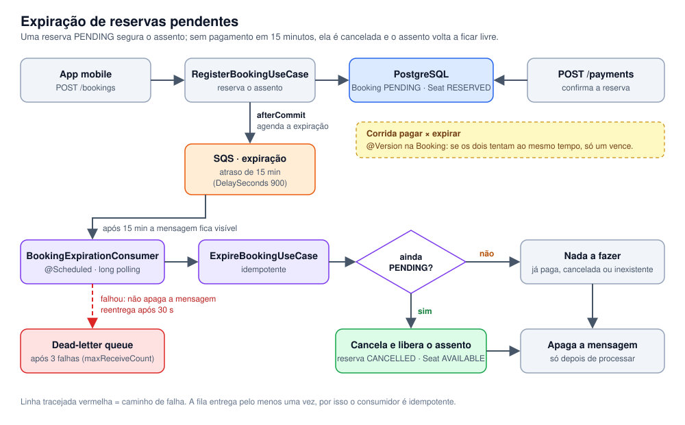

# Expiração de reservas (SQS)

[← Voltar ao README](../README.md)

Como uma reserva pendente é cancelada sozinha 15 minutos depois.

Uma reserva nasce `PENDING` e já tira o assento de circulação. Sem esta fila, quem abandonasse o pagamento prendia o assento para sempre. Agora, **15 minutos depois de criada, uma reserva ainda `PENDING` é cancelada sozinha e o assento volta a ficar livre**.



Como funciona:

1. `POST /bookings` cria a reserva e, **depois do commit** (`afterCommit`), agenda uma mensagem `{"bookingId": N}` na fila `dbook-booking-expiration` com `DelaySeconds = 900`. A mensagem fica invisível durante os 15 minutos.
2. Quando ela fica visível, o `BookingExpirationConsumer` (`@Scheduled`, long polling) a lê e chama o `ExpireBookingUseCase`.
3. O use case é **idempotente**: se a reserva não existe mais ou já não está `PENDING` (foi paga ou cancelada), não faz nada. Se ainda está `PENDING`, reaproveita o `CancelBookingUseCase`, que cancela, libera o assento e avisa a disponibilidade em tempo real.
4. A mensagem só é **apagada depois de processada**. Se algo falha, ela não é apagada: a SQS a entrega de novo após 30 s (`VisibilityTimeout`) e, depois de 3 falhas (`maxReceiveCount`), a move para a **DLQ** (`dbook-booking-expiration-dlq`), onde pode ser inspecionada sem travar a fila principal.

**Pagar × expirar ao mesmo tempo.** Os dois leem a reserva `PENDING` e cada um quer gravar o seu resultado. A `Booking` tem lock otimista (`@Version`, migration `V24`): só um dos dois consegue gravar, o outro falha e a transação dele é desfeita. Sem isso, a reserva poderia terminar `CONFIRMED` com o assento liberado, vendendo o mesmo assento duas vezes. Há um teste de concorrência que repete essa corrida 20 vezes.

**Decisões e limites**

- **A SQS entrega pelo menos uma vez**, então mensagem duplicada é normal; é a idempotência do use case que a torna inofensiva.
- **15 minutos é o máximo** que uma mensagem SQS pode ser atrasada (900 s). Prazos maiores exigiriam outra estratégia.
- **A reserva expirada fica `CANCELLED`**, sem um status `EXPIRED` novo, para não mudar o contrato com o app.
- **Falha ao agendar é logada, não lançada.** O agendamento acontece depois do commit; lançar exceção ali devolveria um erro para uma reserva que existe. Isso deixa uma janela conhecida (*dual write*): se a aplicação cair entre o commit e o envio, aquela reserva não expira sozinha. A solução é um *outbox* transacional (gravar o evento na mesma transação e publicar por um relay), não implementado aqui.
- **O pagamento continua síncrono**: não há gateway real. Com um gateway que confirma depois (Pix, boleto, 3DS), a confirmação viraria um evento assíncrono e os 15 minutos passariam a significar "o pagamento não foi confirmado a tempo".
- **Sem Terraform da SQS ainda.** Localmente a fila vem do LocalStack; criar o recurso na AWS exigiria uma conta persistente, que o projeto não tem hoje.

**Rodando localmente**

`docker compose up -d` sobe o LocalStack e o script `scripts/localstack-init/01-sqs.sh` cria as duas filas sozinho. O consumidor começa a rodar junto com a aplicação. Para ver a expiração sem esperar 15 minutos, crie uma reserva e envie à mão uma mensagem sem atraso para o mesmo `bookingId`:

```bash
export AWS_ACCESS_KEY_ID=test AWS_SECRET_ACCESS_KEY=test AWS_DEFAULT_REGION=us-east-1
aws --endpoint-url=http://localhost:4566 sqs send-message \
  --queue-url http://sqs.us-east-1.localhost.localstack.cloud:4566/000000000000/dbook-booking-expiration \
  --message-body '{"bookingId": 1}'
```

Em até ~5 s a reserva passa a `CANCELLED` e o assento volta a `AVAILABLE`. Para ver a mensagem real aguardando os 15 minutos: `aws --endpoint-url=http://localhost:4566 sqs get-queue-attributes --queue-url <url> --attribute-names ApproximateNumberOfMessagesDelayed`.

Configuração (`application.yml`): `aws.sqs.region`, `aws.sqs.endpoint` (só no LocalStack; na AWS fica vazio), `booking-expiration.queue-url`, `booking-expiration.consumer.enabled` (desligado nos testes) e `booking-expiration.consumer.wait-seconds`.
