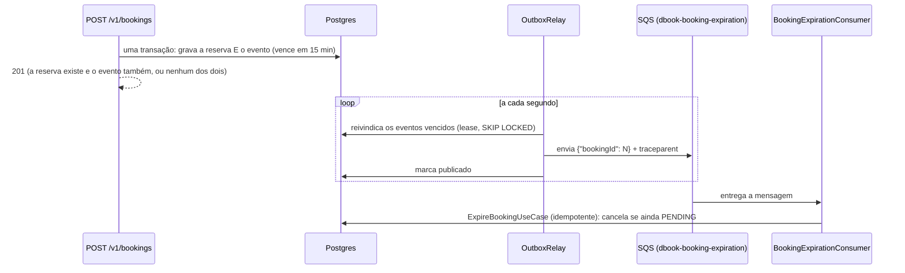

# Mensageria: o outbox transacional

Um evento que sai do sistema (a expiração de uma reserva e os avisos ao cliente: [notificações](notificacoes.md)) precisa sair **se, e só se, a mudança que o causou foi confirmada**. Gravar no banco e mandar para uma fila são duas operações em dois sistemas, e não existe transação entre eles. O outbox resolve isso com uma regra só: **o evento é gravado no mesmo banco, na mesma transação da mudança, e um relé o entrega depois.**

## O problema que isto fecha (o *dual write*)

Antes, a reserva fazia: gravar a reserva → *commit* → mandar uma mensagem à SQS (com `DelaySeconds = 900`). Se o processo caísse entre o *commit* e o envio, **a reserva existia e nunca expirava**; e se o envio falhasse, o erro era engolido de propósito (para não devolver um erro para uma reserva que existe). As duas saídas perdiam a expiração em silêncio.

## Como funciona

**A tabela `outbox_event`** (migration V39): `id`, `aggregate_type`, `aggregate_id`, `type`, `payload` (jsonb), `headers` (jsonb: leva o `traceparent` da requisição que causou o evento), `created_at`, `available_at` (**quando pode sair**: a expiração vence 15 minutos depois da reserva), `next_attempt_at` (quando o relé pode tentar de novo: a reserva em uso ou o *backoff*), `published_at`, `attempts`, `last_error`. Índice parcial só dos não publicados, para o relé ler sempre uma tabela pequena por mais histórico que haja.

**Escrever** (`OutboxWriter.add`, no domínio): usado **dentro** da transação do caso de uso. Fora de uma transação ele **recusa** (`Propagation.MANDATORY`): um evento escrito sozinho poderia sobreviver a uma mudança que foi desfeita, que é exatamente o que o outbox existe para impedir. Uma reserva desfeita deixa, portanto, o evento desfeito junto (testado).

**Entregar** (`OutboxRelay`, a cada segundo): em vez de segurar uma transação do banco durante a chamada de rede, o relé trabalha em três passos curtos, cada um na sua transação:
1. **Reivindicar** um lote de eventos vencidos (`SELECT ... FOR UPDATE SKIP LOCKED`, `UPDATE ... RETURNING`), com uma **reserva** (*lease*): `next_attempt_at` vai para 60 segundos adiante e `attempts` sobe. Várias instâncias da aplicação reivindicam ao mesmo tempo **sem nunca pegar o mesmo evento** (testado com duas threads e 60 eventos).
2. **Entregar** à SQS (`SqsOutboxPublisher`), sem atraso (o outbox já segurou o evento até a hora), com os cabeçalhos, o `eventId` e o `eventType` como atributos da mensagem (o id é o que deixa um consumidor reconhecer uma duplicata).
3. **Marcar publicado.** Se a entrega falha, o evento volta com *backoff* exponencial (5 s, 10 s, 20 s... até 15 minutos) e o erro fica em `last_error`.

**Se o relé morre no meio** (depois de reivindicar, ou depois de entregar e antes de marcar), a reserva expira e o evento é entregue de novo: **no mínimo uma vez**.

**Rota:** o tipo do evento decide a fila. Tudo antes da última palavra, com os pontos virando traços: `booking.expiration.requested` vai para `booking-expiration` (`outbox.queues.booking-expiration`), e `booking.confirmed`, `refund.completed`, `flight.changed`... vão para `booking`, `refund`, `flight`, todas apontando para a fila `dbook-notifications`. Um tipo sem rota **falha** (e aparece no alerta), em vez de ser descartado.

**Limpeza:** de madrugada (03:30) o que foi publicado há mais de 7 dias é apagado: a tabela é uma fila, não um arquivo.

## O que o consumidor precisa saber

- **Pode chegar duplicado.** A entrega é no mínimo uma vez. O `ExpireBookingUseCase` já é idempotente (reserva paga, cancelada ou inexistente vira não fazer nada), e é essa propriedade que torna a duplicata inofensiva. **Todo consumidor novo precisa ser assim.**
- **A ordem não é garantida.** Eventos de vencimentos diferentes saem na ordem em que vencem, mas uma falha adia só o seu evento, e os seguintes passam. Quem precisa de ordem entre dois eventos deve carregar isso no dado (um número, uma data), nunca na ordem de chegada.

## Operar

Métricas ([Observabilidade](observabilidade.md#32-métricas)): `dbook_outbox_pending` (quantos esperam, os agendados incluídos), **`dbook_outbox_overdue_seconds`** (o atraso do mais atrasado, medido pela hora em que **devia** sair, não pela da próxima tentativa, então uma fila fora do ar por muito tempo aparece como atraso crescente), `dbook_outbox_published_total` e `dbook_outbox_failures_total` por tipo. O alerta **`OutboxOverdue`** dispara com mais de 5 minutos de atraso por 5 minutos ([runbook](runbooks.md#outboxoverdue)). Para olhar a tabela: `select type, attempts, last_error, available_at from outbox_event where published_at is null order by available_at`.

Configuração: `outbox.queues.*` (rotas), `outbox.relay.delay-ms`, `outbox.relay.batch-size` (50), `outbox.relay.lease-seconds` (60), `outbox.relay.retention-days` (7) e `outbox.relay.enabled` (desligado nos testes, que chamam o relé à mão).

## Verificado ao vivo

Com a aplicação de verdade (Postgres, Redis, LocalStack): uma reserva gravou o seu evento (vencendo em 14 min 59 s), o relé o publicou, o consumidor expirou a reserva e o assento voltou a `AVAILABLE`, com a linha do tempo mostrando o usuário criando e o **sistema** cancelando. E com o **SQS parado**: a reserva foi criada com `201` (o evento ficou no banco, o relé tentou duas vezes e guardou o erro), e quando o SQS voltou o evento foi entregue e a reserva expirou. Foi exatamente a janela que antes perdia a expiração.

## A decisão: outbox, CDC ou ignorar

| Opção | Prós | Contras |
|---|---|---|
| **Ignorar** (o que havia: `afterCommit` + SQS) | zero infraestrutura nova | perde a expiração numa queda entre o *commit* e o envio, ou numa falha engolida: assentos presos para sempre |
| **CDC** (Debezium lendo o log do Postgres) | sem relé na aplicação; latência baixa | um serviço novo para operar (Kafka Connect ou Debezium Server), configuração do Postgres (`wal_level = logical`, *replication slot*), muito mais peça para o problema deste tamanho |
| **Outbox com relé** (**escolhido**) | só Postgres e a SQS que já existem; testável por inteiro; o evento vence na hora certa sem o limite de 900 s da SQS; várias instâncias sem coordenar | um relé a operar (um alerta e uma tabela), entrega no mínimo uma vez |

Escolhido o outbox porque entrega a garantia (nada se perde) com o menor custo operacional, e porque o M36 (notificações) precisa dele. O CDC passa a valer a pena quando o volume de eventos for tal que consultar a tabela a cada segundo pese, o que está muito longe deste projeto.

## Fora do escopo (de propósito)

Garantir **ordem** entre eventos; entrega **exatamente uma vez** (exige que o consumidor guarde o que já viu, e o consumidor idempotente é mais simples e igualmente seguro); trocar a SQS por outro destino (a porta `OutboxPublisher` é o ponto); o Terraform da SQS (20.5, depende de uma conta AWS persistente).
