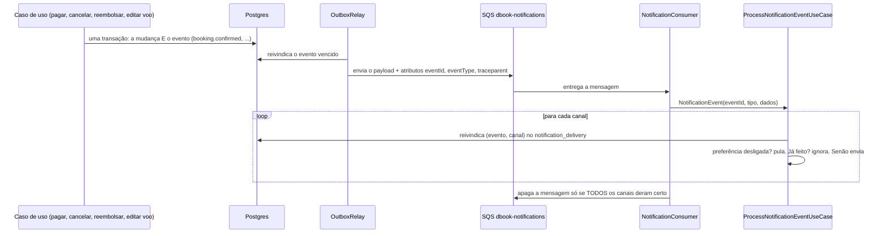

# Notificações

O cliente é avisado do que aconteceu com a viagem dele: reserva confirmada, reserva expirada, reserva cancelada pelo suporte, reembolso concluído e voo alterado. Cada aviso chega por até **três canais**: a caixa de entrada no app (*in-app*), o e-mail e o push. O desenho tem uma regra de ouro, herdada do [outbox](mensageria.md): **o aviso só existe se a mudança que o causou foi confirmada, e nunca é entregue duas vezes.**

## O caminho de um aviso

## Os eventos

Escritos pelo próprio caso de uso, **na mesma transação** da mudança (`OutboxWriter`), com `customerId`, o título do voo e o que mais o texto precisa:

| Evento (tipo do outbox) | Escrito por | Quando |
|---|---|---|
| `booking.confirmed` | `RegisterPaymentUseCase` | um por reserva paga (ida e volta geram dois) |
| `booking.expired` | `CancelBookingUseCase` (origem `EXPIRATION`) | a reserva venceu sem pagamento |
| `booking.cancelled-by-staff` | `CancelBookingUseCase` | alguém da equipe cancelou a reserva de outro; o dono cancelando a própria **não** gera aviso |
| `refund.completed` | `RefundSettler` | o reembolso foi concluído (com o valor) |
| `price-alert.triggered` | `EvaluatePriceAlertsUseCase` | um preço atendeu o alvo de um alerta ([precos.md](precos.md)); uma vez por janela de 24 h |
| `flight.changed` | `UpdateFlightUseCase` | um por reserva ativa, **só** se número, origem, destino, partida ou chegada mudaram (preço e capacidade não são avisos); reservas canceladas não são avisadas |

O tipo decide a fila: `booking.*`, `refund.*` e `flight.*` vão para `dbook-notifications` (`outbox.queues.booking|refund|flight`); `booking.expiration.requested` segue para a fila da expiração.

## Idempotência: por evento e por canal

A SQS entrega **no mínimo uma vez**, então o mesmo evento pode chegar duas vezes. A tabela `notification_delivery` (chave `event_id + channel`) decide, com **um único comando SQL** (`INSERT ... ON CONFLICT ... RETURNING`), o que cada tentativa é:

- **NEW:** nunca tentado; envia.
- **RETRY:** tentado e não confirmado (queda, ou o canal falhou); tenta de novo.
- **ALREADY_DONE:** já enviado ou pulado; não faz nada.

Além disso, `notification.event_id` é **único**: mesmo que algo furasse a tabela de entregas, a mesma notificação não aparece duas vezes na caixa de entrada.

## Um canal que falha não derruba os outros

O processamento tenta **todos** os canais. Se algum falhou (o servidor de e-mail caiu, o serviço de push não respondeu), a mensagem **não é apagada**: a SQS a entrega de novo depois de 30 s, os canais já feitos são ignorados pelo log de entregas e **só o que falhou roda de novo**. Depois de 3 tentativas a mensagem vai para a **fila de mensagens mortas** (`dbook-notifications-dlq`), onde aparece no gauge `dbook_sqs_dlq_depth{queue="notifications"}` e no alerta `DeadLetterQueueNotEmpty` ([runbook](runbooks.md#deadletterqueuenotempty)). Um evento de tipo desconhecido, ou sem `eventId`, também vai para lá (falha de propósito, para ser visto).

## Canais e preferências

- **In-app** grava em `notification`. Sempre há para onde enviar.
- **E-mail** usa o `EmailSender` (o mesmo dos convites), texto em português, para o endereço da conta. Conta **anonimizada** não recebe (o endereço dela não existe mais): é *skipped*.
- **Push** usa a porta `PushSender`. Hoje o adaptador é `LoggingPushSender`, que só registra **quantos** aparelhos receberiam (nunca o token). Sem aparelho registrado, é *skipped*. **Evolução registrada:** o adaptador real do FCM, que exige uma conta Firebase; trocá-lo é escrever um `PushSender`.
- **Preferências** (`notification_preference`): guardam **só o que o cliente escolheu**; quem não escolheu nada tem tudo ligado, então um tipo novo de aviso chega a todos até que o cliente o desligue. Desligado = *skipped*, não enviado.

## Métricas

`dbook_notification_total{channel, outcome}` com `outcome` = `sent`, `skipped`, `duplicate` ou `failed`; e `dbook_notification_messages_total{outcome="failed"}` para mensagens que o consumidor não conseguiu nem ler. Um aumento de `failed` num canal é o sinal de que o servidor de e-mail (ou o push) está com problema.

## A API (autenticada; sempre a caixa do próprio usuário)

| Endpoint | O que faz |
|---|---|
| `GET /v1/notifications?cursor=&size=&unreadOnly=` | a caixa, mais novas primeiro; paginação por **cursor** (`nextCursor`), porque a lista só cresce |
| `GET /v1/notifications/unread-count` | o número do *badge* |
| `POST /v1/notifications/{id}/read` | marca uma como lida (`404` se não for sua: parece igual a uma que não existe) |
| `POST /v1/notifications/read-all` | marca todas |
| `GET /v1/notifications/preferences` | cada tipo em cada canal, com o que vale hoje |
| `PUT /v1/notifications/preferences` | corpo: lista de `{type, channel, enabled}`; só os pares enviados mudam |
| `POST /v1/notifications/devices` | registra o aparelho `{token, platform}` (o mesmo token de novo só o atualiza; se outra pessoa o registra, ele **muda de dono**) |
| `DELETE /v1/notifications/devices/{token}` | deixa de receber push nesse aparelho (ao sair da conta) |

## Privacidade

A anonimização de um cliente ([crm.md](crm.md)) apaga as notificações, os aparelhos e as preferências dele.

## Configuração

`notifications.queue-url`, `notifications.dlq-url` (a profundidade vira o gauge), `notifications.consumer.enabled` (desligado nos testes) e `notifications.consumer.wait-seconds`; `dead-letter-queues.queues.*` lista as filas que o gauge acompanha; `outbox.queues.booking|refund|flight` a rota dos eventos. Local: o `scripts/localstack-init/01-sqs.sh` cria `dbook-notifications` e sua DLQ. Produção: o módulo `terraform/modules/sqs` (as duas filas e suas DLQs; a ligação ao ECS entra no M43).
