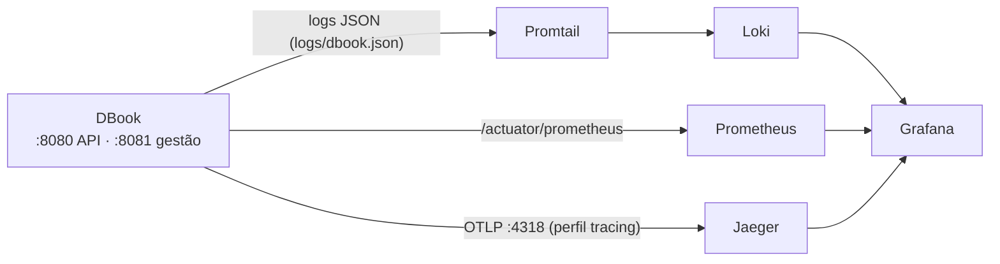

# Observabilidade

[← Voltar ao README](../README.md)

Observabilidade é a capacidade de **descobrir o que o sistema está fazendo olhando só para o que ele emite**, sem precisar adivinhar nem reproduzir o problema. Este documento explica o conceito, o que foi usado, como foi implementado, onde acessar e como investigar um problema na prática.

- [1. O conceito](#1-o-conceito)
- [2. O que foi usado](#2-o-que-foi-usado)
- [3. Como cada pilar foi implementado](#3-como-cada-pilar-foi-implementado)
- [4. Onde acessar](#4-onde-acessar)
- [5. Roteiros: como investigar um problema](#5-roteiros-como-investigar-um-problema)
- [6. Como implementar no dia a dia (guia de desenvolvimento)](#6-como-implementar-no-dia-a-dia-guia-de-desenvolvimento)
- [7. Configuração](#7-configuração)
- [8. Como isso é protegido por testes](#8-como-isso-é-protegido-por-testes)
- [9. Decisões, armadilhas e limites](#9-decisões-armadilhas-e-limites)

---

## 1. O conceito

Existem três tipos de sinal, e cada um responde a uma pergunta diferente:

| Pilar | Pergunta que responde | Exemplo neste projeto |
|---|---|---|
| **Métricas** | *Está bom ou ruim? Quanto? Está piorando?* | pedidos por segundo, latência p95, quantas reservas estão pendentes agora |
| **Logs** | *O que aconteceu, exatamente?* | `GET /v1/bookings -> 200 in 134 ms`, com o usuário e o id da requisição |
| **Traces** | *Por onde a requisição passou e onde demorou?* | `POST /v1/bookings` → segurança → caso de uso → 4 consultas SQL |

Sozinho, cada um é limitado: a métrica diz que **algo** está lento mas não **qual** requisição; o log diz o que houve numa requisição mas não mostra o tempo de cada etapa; o trace mostra as etapas mas é amostrado. O valor está em **ligá-los**: um painel de métrica mostra o pico → um log mostra a requisição problemática → o `traceId` dessa linha abre o trace completo. Foi isso que se montou aqui.

Termos usados neste documento:

- **Trace**: o caminho completo de uma requisição. **Span**: uma etapa dentro dele (um caso de uso, uma consulta SQL). Os spans formam uma árvore.
- **MDC**: um "bloco de notas" por thread do Logback; tudo que está nele (`requestId`, `userId`, `traceId`) sai em cada linha de log daquela requisição.
- **Cardinalidade**: quantos valores diferentes uma etiqueta de métrica pode ter. Cada valor novo vira uma série nova no Prometheus, então etiqueta de alta cardinalidade (um id, um e-mail) o derruba.
- **Liveness × readiness**: *liveness* = o processo está vivo? (se não, reinicia). *Readiness* = está pronto para receber tráfego? (se não, para de mandar requisições, sem reiniciar).
- **OTLP**: o protocolo aberto do OpenTelemetry para enviar traces a um coletor.

## 2. O que foi usado

| Peça | Tecnologia | Papel |
|---|---|---|
| Endpoints operacionais | **Spring Boot Actuator** | `health`, `metrics`, `prometheus`, numa porta separada |
| API de métricas e observações | **Micrometer** | um único jeito de medir, independente do destino |
| Formato de métricas | **micrometer-registry-prometheus** | expõe as métricas no formato que o Prometheus lê |
| Medir os casos de uso | **`@Observed`** + `spring-boot-starter-aop` | uma anotação gera timer e span de cada caso de uso |
| Logs estruturados | **Logback** + **logstash-logback-encoder** | uma linha = um objeto JSON |
| Contexto nos logs | **MDC** + `RequestLoggingFilter` | `requestId`, `userId`, `traceId` em toda linha |
| Tracing | **Micrometer Tracing** + ponte **OpenTelemetry** | cria os spans e propaga o contexto |
| Envio de traces | **opentelemetry-exporter-otlp** | exporta por OTLP (opt-in) |
| Spans de SQL | **datasource-micrometer-spring-boot** | um span por consulta (sem os valores dos parâmetros) |
| Coleta de métricas | **Prometheus** | busca as métricas a cada 15 s e guarda a série temporal |
| Coleta de logs | **Promtail** + **Loki** | lê `logs/dbook.json` e guarda os logs |
| Armazenar/ver traces | **Jaeger** | recebe OTLP e mostra a árvore de spans |
| Tela única | **Grafana** | Prometheus, Loki e Jaeger numa interface, com dashboard |
| Orquestração local | **Docker Compose** (perfil `observability`) | sobe a pilha toda com um comando |



## 3. Como cada pilar foi implementado

### 3.1 Health (liveness e readiness)

- `GET /actuator/health/liveness`: só diz se o processo está de pé.
- `GET /actuator/health/readiness`: confere o **Postgres** e o **Redis**; se um cair, responde `503` e o liveness continua `200`. Isso foi verificado derrubando o Redis de verdade.
- Tudo fica na **porta de gestão 8081**, que nunca é exposta publicamente (o Dockerfile e o Terraform do ECS só mapeiam a 8080). Na 8080 os mesmos caminhos continuam exigindo autenticação; há um teste que garante isso.
- O `GET /health` antigo continua existindo, só devolve `UP`, e não checa nada.

### 3.2 Métricas

Três origens:

1. **Automáticas**, de graça: HTTP (`http_server_requests_*`, com histograma para calcular p95), JVM (memória, threads, GC) e o pool de conexões (`hikaricp_*`).
2. **Por caso de uso**, com `@Observed(name = "dbook.usecase")` em cada `*UseCase`: gera `dbook_usecase_seconds_*` com as etiquetas `class`, `method` e `error` (`none` ou o nome da exceção). Uma única métrica, filtrada por `class`. Uma regra de arquitetura (`EveryUseCaseIsObservedTest`) **reprova o build** se um caso de uso novo ficar sem a anotação.
3. **De negócio**, só o que ajuda a operar:

| Métrica | Etiqueta | Responde |
|---|---|---|
| `dbook_payment_total` | `outcome` = `created`, `replayed` | quantos pagamentos são novos e quantas retentativas a idempotência absorveu |
| `dbook_booking_expiration_total` | `outcome` = `expired`, `ignored`, `failed` | o que a fila de expiração fez com cada mensagem (`ignored` = já paga ou inexistente; `failed` = vai para a DLQ) |
| `dbook_auth_login_total` | `outcome` = `success`, `invalid_credentials`, `blocked`, `rate_limited`; `audience` = `client`, `staff` | como os logins terminam, por porta de entrada: um pico de `invalid_credentials` ou `rate_limited` é tentativa de adivinhar senha |
| `dbook_admin_action_total` | `action` (ex.: `FLIGHT_CREATED`, `ACCESS_DENIED`), `outcome` = `SUCCESS`, `DENIED` | ações administrativas feitas e negadas; cada uma tem um registro na trilha de [auditoria](auditoria.md) |
| `dbook_booking_pending` (gauge) | — | **quantas reservas estão `PENDING` agora**: assentos presos esperando pagamento. Se só cresce, a expiração não está funcionando |
| `dbook_outbox_pending` (gauge) | — | eventos do outbox ainda não publicados, os agendados para depois incluídos (cada reserva dos últimos 15 minutos tem um: é normal) |
| `dbook_outbox_overdue_seconds` (gauge) | — | **o atraso do evento mais atrasado**, 0 se nenhum está atrasado (medido pela hora em que devia sair, não pela da próxima tentativa): é o que se alerta ([Mensageria](mensageria.md)) |
| `dbook_outbox_published_total` / `dbook_outbox_failures_total` | `type` | eventos entregues e tentativas que falharam, por tipo |
| `dbook_sqs_dlq_depth` (gauge) | `queue` = `booking-expiration` ou `notifications` | **quantas mensagens estão na fila de mensagens mortas** de cada fila (lida do SQS a cada coleta; `NaN`, sem dado, quando o SQS não responde): acima de zero, uma mensagem falhou 3 vezes: uma expiração (o assento pode estar preso) ou um aviso (o cliente pode não ter sido informado) |
| `dbook_refund_total` | `outcome` = `completed`, `failed`, `replayed`, `conflict` | como os reembolsos terminam; um `failed` precisa de retry ([Reembolso](reembolso.md)) |
| `dbook_cache_total` | `cache` = `dashboard`; `outcome` = `hit`, `miss`, `error` | quanto o cache vale e se o Redis está respondendo ([Dashboard](dashboard.md#o-cache-o-primeiro-do-projeto)) |

Detalhes que importam:

- O `created` conta **depois do commit** (`afterCommit`): um pagamento desfeito (perdeu a corrida contra um cancelamento) não pode contar como criado.
- O gauge é lido do banco a cada coleta (a cada 15 s). A consulta usa `status = 'PENDING'` **literal**, de propósito, para o PostgreSQL usar o **índice parcial** `idx_booking_pending` (migration `V26`), que fica pequeno por maior que a tabela fique.
- A contagem usa a *extension* `MeterRegistry.countOutcome(nome, outcome)`, que garante a etiqueta padronizada.

### 3.3 Logs

A aplicação loga em formatos escolhidos por **perfil do Spring**:

| Perfil | O que faz |
|---|---|
| *(nenhum)* | linha legível: `21:10:06.286 INFO [requestId] [trace=...] [user=33] ... - GET /v1/bookings -> 200 in 134 ms` |
| `json` | **um objeto JSON por linha** (é o que o Terraform do ECS ativa) |
| `logfile` | também grava `logs/dbook.json`, com rotação (50 MB ou diária, 7 dias, teto de 500 MB), para o Promtail ler |

Cada requisição ganha um **`requestId`** e termina com **uma linha de acesso**. No JSON:

```json
{"@timestamp":"2026-10-03T21:10:06.28-03:00","level":"INFO","message":"GET /v1/bookings -> 200 in 134 ms",
 "requestId":"demo-bookings-1","traceId":"426051cdbe04b92450adb9be7cc60ccb","spanId":"b7ad6b7169203331",
 "userId":"33","status":200,"duration_ms":134,"app":"dbook", "logger_name":"...RequestLoggingFilter", ...}
```

- O `requestId` está em **todas** as linhas da requisição e volta no cabeçalho de resposta `X-Request-Id`. O cliente pode mandar o seu, mas só vale se for curto e simples (`A-Z a-z 0-9 . _ -`, até 64 caracteres); senão é trocado por um UUID, para que um cabeçalho nunca injete quebras de linha ou texto arbitrário no log.
- O `userId` aparece nas requisições autenticadas. Linhas que não vêm de HTTP (o consumidor da fila) não têm `requestId` nem `userId`.
- Um `5xx` sai como `ERROR`; o resto, como `INFO`.
- **Nunca logado:** a *query string* (pode carregar token), os cabeçalhos (`Authorization`) e os corpos (senha, dados de cartão). Há teste para a query string.
- `status` e `duration_ms` são **campos separados** no JSON, então dá para filtrar e agregar por eles em vez de interpretar texto.

### 3.4 Tracing

- Os **spans são sempre criados**, então o `traceId` está em toda linha de log mesmo sem coletor.
- O **envio** dos spans é *opt-in*, pelo perfil `tracing`. Sem coletor, o exportador enchia o log de `Failed to export spans`.
- Um `POST /v1/bookings` gera uma árvore assim (18 spans, vista de verdade no Jaeger):

```
http post /v1/bookings
  security filterchain before → authorize request
  secured request
    register-booking-use-case#execute
      query · result-set · query · result-set ...   (um span por consulta SQL)
  security filterchain after
```

- **Propagação entrada:** se o chamador manda o cabeçalho W3C `traceparent`, o trabalho aqui **continua o trace dele** em vez de abrir outro (o app mobile poderá usar isso).
- **Propagação pela fila SQS:** a expiração roda 15 minutos depois, em outra thread. O contexto do trace viaja no **atributo `traceparent` da mensagem**, e o consumidor abre o span `booking-expiration consume` como filho do que agendou. Resultado, num único trace:

```
http post /v1/bookings
booking-expiration consume
  expire-booking-use-case#execute
    cancel-booking-use-case#execute
```

### 3.5 A ligação entre os três

- O `traceId` de uma linha de log é o **mesmo** do trace no Jaeger (verificado).
- No Grafana, a fonte Loki tem um **campo derivado** que extrai o `traceId` de cada linha e abre o trace no Jaeger. Do log ao trace em um clique.

## 4. Onde acessar

Suba a pilha (a aplicação roda no seu terminal, a pilha em contêineres):

```bash
docker compose up -d                                   # Postgres, Redis, LocalStack (base)
docker compose --profile observability up -d           # Prometheus, Alertmanager, Grafana, Loki, Promtail, Jaeger
SPRING_PROFILES_ACTIVE=tracing,json,logfile ./gradlew bootRun
```

| O quê | Endereço | Observação |
|---|---|---|
| **Grafana** (tela única) | http://localhost:3000 | sem login (só local). Dashboard **"DBook — visão geral"**: http://localhost:3000/d/dbook-overview |
| Logs (Loki) | Grafana → **Explore** → fonte *Loki* | consultas na seção 5 |
| Traces (Jaeger) | http://localhost:16686 (ou Grafana → Explore → *Jaeger*) | serviço `dbook` |
| Métricas (Prometheus) | http://localhost:9090 | em *Status → Targets* o alvo `dbook` deve estar `UP`; em *Alerts* as regras |
| **Alertas** (Alertmanager) | http://localhost:9093 | o que está disparando e para onde vai; o painel de SLOs: http://localhost:3000/d/dbook-slo |
| Métricas cruas da aplicação | http://localhost:8081/actuator/prometheus | |
| Health | http://localhost:8081/actuator/health/liveness e `/readiness` | |
| Logs em arquivo | `logs/dbook.json` | um JSON por linha; pasta ignorada pelo Git |

Só `json,logfile` já basta para logs; só `tracing` já basta para traces. Cada perfil é independente.

**Parar a pilha:** use `docker compose stop loki promtail grafana prometheus jaeger`. Atenção: `docker compose --profile observability stop` **sem nomes** para **todos** os serviços, inclusive o Postgres e o Redis.

### Sem nenhuma ferramenta (só `jq`)

```bash
jq -c 'select(.level=="ERROR")' logs/dbook.json                               # só os erros
jq -c 'select(.requestId=="demo-bookings-1")' logs/dbook.json                 # tudo de uma requisição
jq -c 'select(.status==401) | {requestId, message}' logs/dbook.json           # respostas 401
jq -c 'select(.duration_ms > 500) | {message, duration_ms}' logs/dbook.json   # requisições lentas
```

### 3.2.1 Alertas, SLOs e runbooks

As métricas acima viram **alertas** em `observability/alerts.yml` (disponibilidade, 5xx, latência da busca, fila de mensagens mortas, reservas pendentes, reembolsos falhos, picos de login e de acesso negado, cache), enviados ao **Alertmanager** (`http://localhost:9093`) e dali a um receptor (`observability/alertmanager.yml`, um *webhook* de exemplo). Cada alerta aponta para um **runbook** em [Runbooks](runbooks.md): o que significa, onde olhar, como mitigar. Os **SLOs** (99,5 % de disponibilidade em 30 dias; p95 da busca abaixo de 500 ms) e o orçamento de erro estão no painel **"DBook — SLOs e orçamento de erro"**. As regras são **testadas** (`observability/alerts_test.yml`, com o `promtool`: cada alerta recebe séries que devem e que não devem dispará-lo) localmente e no CI.

```bash
docker run --rm -v "$PWD/observability:/obs" --entrypoint promtool prom/prometheus:v2.55.0 check rules /obs/alerts.yml
docker run --rm -v "$PWD/observability:/obs" --entrypoint promtool prom/prometheus:v2.55.0 test rules /obs/alerts_test.yml
```

## 5. Roteiros: como investigar um problema

### "Um usuário reclamou de um erro"
1. Peça o `requestId` (vem no cabeçalho de resposta `X-Request-Id`; o app pode exibi-lo) ou o horário e o usuário.
2. No Grafana → Explore → **Loki**: `{job="dbook"} | json | requestId="<id>"` (ou `| userId="33"`). Veja a linha de acesso e as linhas de erro.
3. Clique no `traceId` da linha: abre o trace no **Jaeger**, com cada etapa e a consulta SQL que falhou.

### "A API ficou lenta"
1. No dashboard, **Latência p95 por rota**: qual rota piorou?
2. **Latência p95 por caso de uso**: é um caso de uso específico?
3. No Loki: `{job="dbook"} | json | duration_ms > 500` para achar requisições lentas; abra o trace de uma e veja **qual span** (ou qual SQL) consome o tempo.

### "Há assentos presos / reservas que não expiram"
1. No dashboard, **Reservas pendentes agora**: está subindo sem parar?
2. **Expiração por resultado**: aparecem `failed`? Se sim, o consumidor está falhando.
3. No Loki: `{job="dbook", level="ERROR"} |= "booking expiration"`. As mensagens que falham 3 vezes vão para a DLQ (`dbook-booking-expiration-dlq`).

### Consultas prontas

**LogQL (Loki)** (todas testadas contra o Loki de verdade):

| O que você quer | Consulta |
|---|---|
| tudo da aplicação | `{job="dbook"}` |
| só avisos e erros | `{job="dbook", level=~"WARN\|ERROR"}` |
| tudo de uma requisição | `{job="dbook"} \| json \| requestId="demo-bookings-1"` |
| o que um usuário fez | `{job="dbook"} \| json \| userId="33"` |
| respostas 401 | `{job="dbook"} \| json \| status = 401` |
| requisições lentas (> 100 ms) | `{job="dbook"} \| json \| duration_ms > 100` |
| procurar um texto | `{job="dbook"} \|= "palavra"` |

(O `\|` é só para o Markdown não quebrar a coluna; na consulta real é um `|` simples.)

**PromQL (Prometheus)** (as do dashboard, todas executadas):

```promql
dbook_booking_pending                                                              # assentos presos agora
sum by (status) (rate(http_server_requests_seconds_count[1m]))                     # requisições por segundo
histogram_quantile(0.95, sum by (le, uri) (rate(http_server_requests_seconds_bucket[5m])))   # p95 por rota
sum by (outcome) (increase(dbook_payment_total[5m]))                               # pagamentos novo × reprocessado
sum by (outcome) (increase(dbook_booking_expiration_total[5m]))                    # resultado das expirações
```

Só o `level` vira *label* no Loki; `requestId`, `userId` e `status` ficam na linha e são filtrados com `| json`. Etiquetas com muitos valores distintos derrubam o desempenho do Loki.

## 6. Como implementar no dia a dia (guia de desenvolvimento)

**Caso de uso novo.** Anote com `@Observed(name = "dbook.usecase")` acima do `@Service` (e importe `io.micrometer.observation.annotation.Observed`). O teste `EveryUseCaseIsObservedTest` reprova o build se esquecer. Isso já dá o timer, o span e o painel de latência.

**Métrica de negócio nova.** Injete o `MeterRegistry` e use a extension:

```kotlin
meterRegistry.countOutcome("dbook.algo", "resultado")   // etiqueta "outcome" com um conjunto pequeno e fixo
```

Regras: o nome é minúsculo com pontos; os valores de `outcome` são poucos e conhecidos (nunca um id, e-mail ou texto livre); se o evento só vale depois que a transação confirma, conte dentro de `afterCommit { ... }`. Para um valor que sobe e desce (um estoque, uma fila), use um `Gauge` num `MeterBinder`, como o `PendingBookingsMetrics`.

**Log novo.** Use o `LoggerFactory` e frases curtas. **Nunca** logue token, `Authorization`, corpo de requisição, query string nem dado de cartão. Para um campo consultável, passe `kv("campo", valor)` (do logstash) como argumento extra: vira um campo do JSON. Quem tem `requestId`/`traceId` no MDC já os recebe sozinho.

**Span manual.** Dentro de código que não é um caso de uso (um adapter, um consumidor), use o `Tracer`: abra um span, rode o trabalho dentro de `tracer.withSpan(span).use { ... }` e feche com `span.end()`. Marque falha com `span.error(ex)`. O consumidor da fila (`BookingExpirationConsumer`) é o exemplo.

**Propagar o contexto por outra fronteira assíncrona** (outra fila, um evento). Faça como o par `SqsBookingExpirationScheduler` (injeta o `traceparent` no que envia) e `BookingExpirationConsumer` (extrai no que recebe), usando o `Propagator`.

**Painel novo.** Edite `observability/grafana/dashboards/dbook-overview.json` (ou acrescente outro `.json` na pasta) e reinicie o Grafana: o dashboard é provisionado por arquivo. Valide a consulta no Prometheus antes.

## 7. Configuração

| Onde | O quê | Efeito |
|---|---|---|
| `SPRING_PROFILES_ACTIVE` | `json` | logs em JSON |
| | `logfile` | grava `logs/dbook.json` |
| | `tracing` | envia os spans por OTLP |
| `management.server.port` | `8081` | porta de gestão (actuator) |
| `management.endpoints.web.exposure.include` | `health,info,metrics,prometheus` | o que o actuator expõe |
| `management.tracing.sampling.probability` | `1.0` | fração das requisições traçadas. Em produção, reduza pela variável `MANAGEMENT_TRACING_SAMPLING_PROBABILITY` |
| `management.otlp.tracing.endpoint` | `http://localhost:4318/v1/traces` | para onde o perfil `tracing` envia |
| `management.metrics.distribution.percentiles-histogram` | `http.server.requests`, `dbook.usecase` | histogramas, necessários para o p95 |
| `management.observations.annotations.enabled` | `true` | faz o `@Observed` funcionar |

Arquivos: `src/main/resources/logback-spring.xml` (logs), `application.yml` e `application-tracing.yml`, `observability/` (Prometheus, Promtail, Grafana e o dashboard) e o perfil `observability` do `docker-compose.yml`.

## 8. Como isso é protegido por testes

| O que | Teste |
|---|---|
| liveness, readiness, `/actuator/prometheus` com métricas de JVM e HTTP | `infrastructure/observability/` (com a aplicação em duas portas reais) |
| a porta pública **não** serve o actuator | `PublicPortDoesNotServeActuatorTest` (verificado por mutação) |
| um caso de uso anotado vira métrica | `AnObservedUseCaseIsTimedTest` |
| todo caso de uso tem `@Observed` | `EveryUseCaseIsObservedTest` (ArchUnit) |
| `requestId` gerado / mantido / substituído quando inseguro | `infrastructure/web/requestloggingfilter/` |
| uma linha de acesso por requisição, sem query string, com `userId` e `traceId` | idem |
| uma requisição com `traceparent` continua o trace de quem chamou | `ContinuesTheTraceSentByTheCallerTest` |
| o formato JSON real do perfil `json` | `JsonProfileWritesStructuredLogsTest` |
| o contador de pagamento só conta depois do commit | `DoesNotCountAPaymentThatNeverCommitsTest` (verificado por mutação) |
| o gauge de pendentes lê o valor do momento, e a consulta conta só as pendentes | `pendingbookingsmetrics/`, `CountsOnlyThePendingBookingsTest` (por mutação) |
| o gauge da fila de mensagens mortas lê a profundidade do SQS (e dá `NaN`, não zero, sem resposta) | `TheDeadLetterQueueDepthIsAGaugeTest` |
| as regras de alerta são válidas e disparam (e não disparam) quando devem | `observability/alerts_test.yml` (`promtool`), no CI (job `alert-rules`) |
| o trace atravessa a fila SQS | `ContinuesTheTraceOfTheRequestThatScheduledItTest`, `AttachesTheTraceContextToTheMessageTest` (por mutação) |

## 9. Decisões, armadilhas e limites

**Decisões**
- **OpenTelemetry**, não um cliente proprietário: é o padrão aberto, e o mesmo código serve a Jaeger, X-Ray ou qualquer coletor que fale OTLP.
- **Porta de gestão separada**: o que é operacional nunca divide porta com a API pública.
- **`@Observed` mais poucas métricas explícitas**, em vez de um contador manual em cada lugar.
- **Só `level` é *label* no Loki**: o resto fica no JSON e se filtra na consulta.
- **O envio de traces é opt-in**: spans e `traceId` sempre, exportação só quando há coletor.

**Armadilhas que já apareceram (e estão resolvidas)**
- O Spring Boot **configura o Logback uma vez por JVM**: um teste que depende de um perfil de log passa sozinho e pode falhar na suíte conforme a ordem. O teste do perfil `json` força a reinicialização.
- O OpenTelemetry guarda seu **contexto global na JVM**: usar o SDK real em um teste cedo impede os contextos Spring seguintes de pôr o `traceId` no MDC. Os testes usam um tracer em memória sem estado global.
- No Spring Boot 3.3 o exportador OTLP é a classe `OtlpAutoConfiguration` (`OtlpTracingAutoConfiguration` só a partir da 3.4). Um nome de classe inexistente em `spring.autoconfigure.exclude` é **ignorado em silêncio**.
- O `RequestLoggingFilter` precisa rodar **depois** do filtro de observação do Spring (`HIGHEST_PRECEDENCE + 2`), senão a linha de acesso é escrita depois que o trace fechou e sai sem `traceId`.
- Um `docker compose --profile observability stop` sem nomes para tudo, inclusive o banco.

**Limites (o que NÃO foi feito ou verificado)**
- **Nenhum alerta** foi configurado. O natural seria alertar quando `dbook_booking_pending` só cresce, quando `dbook_booking_expiration_total{outcome="failed"}` sobe, ou quando o readiness fica `503`.
- **A aparência do dashboard renderizado não foi vista** (só validei que as 11 consultas respondem, pelo Prometheus e pela API do próprio Grafana), nem o clique no link do campo derivado na interface.
- **Na AWS nada disso foi executado**, porque o projeto não tem uma conta persistente. O caminho natural: os logs já vão ao CloudWatch (driver `awslogs`) e, com o perfil `json`, o **CloudWatch Logs Insights** consulta por campo; para métricas e traces, o app já fala Prometheus e OTLP, então bastaria um coletor (por exemplo o **AWS Distro for OpenTelemetry**) enviando ao **X-Ray** / **Amazon Managed Prometheus** / **Managed Grafana**. Consultas de exemplo para o Logs Insights:

```
fields @timestamp, level, message, requestId, userId, status, duration_ms
| filter requestId = "demo-bookings-1"
| sort @timestamp asc
```
```
stats count() as requests, pct(duration_ms, 95) as p95_ms by bin(5m)
| filter ispresent(duration_ms)
```

  Essas consultas **não foram executadas**; o formato dos campos é o mesmo que foi consultado no Loki.
- A exportação de spans em produção não está configurada (não há coletor): o ECS roda só com o perfil `json`.
