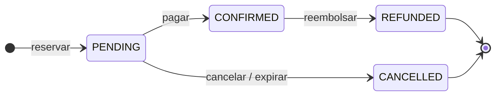
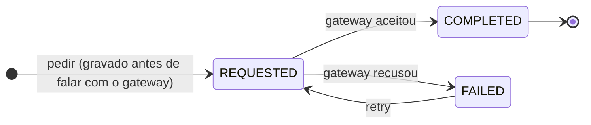
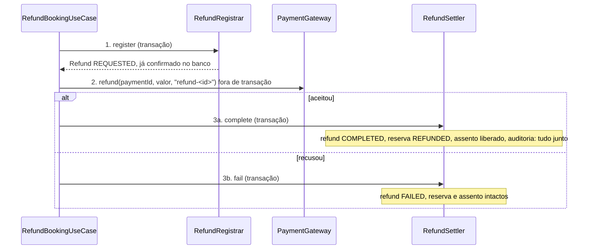

# Reservas (admin) e reembolso

Até aqui o suporte só cancelava reservas `PENDING`, e uma reserva paga e cancelada não devolvia dinheiro. Este marco dá ao suporte o **quadro de qualquer reserva** (com a linha do tempo dos status) e o **reembolso**: uma máquina de estados nova, com dinheiro envolvido, então idempotência e concorrência não são opcionais. Os endpoints estão em [Endpoints](endpoints.md#reservas-admin-e-reembolso-v1adminbookings-e-v1adminrefunds).

## Estados

`REFUNDED` é terminal e vale só para uma reserva `CONFIRMED`. O **reembolso** tem os próprios estados:

## A mini-saga

Falar com o gateway é uma chamada de rede, e segurar uma transação do banco (e os seus travamentos) esperando por ela transformaria um processador lento em uma tabela de reservas travada. Por isso o reembolso é uma **saga de três passos, cada um com a sua transação**, e o caso de uso que a conduz (`RefundBookingUseCase`) **não é transacional**:

- **O passo 1 vem antes do gateway:** se o processo morrer depois dele, o reembolso existe e pode ser refeito; se ele não existisse ainda, uma queda deixaria dinheiro movido sem registro do motivo.
- **O gateway recebe `refund-<id>` como chave de idempotência**, a mesma em toda tentativa daquele reembolso: pedir de novo (retry, queda, duas tentativas) **nunca move o dinheiro duas vezes**.
- **Os dois últimos passos são repetíveis:** completar um reembolso já completo não faz nada de novo (o assento não é liberado duas vezes).
- **A resposta é o reembolso como terminou:** `COMPLETED`, ou `FAILED` (o dinheiro não saiu; `POST /refunds/{id}/retry`). Um `FAILED` volta como `201` com o corpo dizendo o estado: a decisão do portal é pelo `status`, e o replay da mesma chave devolve exatamente a mesma resposta.

## Duas coisas que não podem acontecer

**Dois atendentes reembolsando a mesma reserva.** O banco decide: um índice único **parcial** em `refund(booking_id) WHERE status <> 'FAILED'`. Quem perde o `INSERT` recebe `409`. Um reembolso `FAILED` não segura a vaga, então a reserva pode ser reembolsada de novo (ou o falho, repetido). Testado com duas threads soltas ao mesmo tempo: sai `201` e `409`, e o gateway é chamado **uma** vez.

**A mesma requisição enviada duas vezes.** O `Idempotency-Key` é por atendente: o mesmo par (atendente, chave) é o mesmo reembolso (índice único `(requested_by, idempotency_key)`). Mesma chave e mesmo pedido: devolve o reembolso de antes, sem chamar o gateway. Mesma chave e pedido **diferente**: `422` (nunca um replay silencioso). Se duas cópias chegam juntas, quem perde o `INSERT` responde com o que ganhou.

O componente dessas regras (`fingerprintOf` e `idempotently`) foi extraído do pagamento: o **segundo uso real** (a regra de três). O comportamento do pagamento não mudou, e os testes dele continuam os mesmos.

## A política

Reembolso **integral** até **24 horas antes da partida**. Dentro das 24 horas (ou depois da partida) só um `SUPER_ADMIN`, com `override=true` **e uma nota** dizendo por quê:

| Quem | Dentro da janela | Resposta |
|---|---|---|
| `SUPPORT` | sem `override` | `409 REFUND_WINDOW_CLOSED` (o portal abre o pedido de exceção) |
| `SUPPORT` | com `override` | `403 FORBIDDEN` |
| `SUPER_ADMIN` | `override`, sem nota | `400 VALIDATION_FAILED` |
| `SUPER_ADMIN` | `override` com nota | `201` |

Exatamente 24 horas antes ainda é integral; um segundo depois, não (testado nos dois lados). Uma reserva que não é voo não tem janela. O valor é sempre o `Booking.price` (o preço **congelado** na reserva, não o atual do voo).

## O gateway

`PaymentGateway.refund(paymentId, amount, idempotencyKey)` é uma porta do domínio. Não há processador real por trás deste projeto, então o adaptador (`FakePaymentGateway`) **sempre aceita**. Um adaptador real chamaria o endpoint de reembolso do processador usando a chave como cabeçalho de idempotência, transformaria recusa e *timeout* em `PaymentGatewayException`, nunca registraria dado de cartão, e **substituiria** a classe falsa sem mudar mais nada. Nos testes de integração um gateway controlável o troca para simular a recusa.

## A linha do tempo

`booking_status_history` (V35) registra cada mudança de status, e quem a fez é o usuário autenticado na thread (`null` quando foi o sistema, como a expiração). Quem escreve é o **`BookingRepositoryAdapter`**, na própria gravação da reserva, ao notar que o status mudou: nenhum caso de uso, de hoje ou do futuro, consegue mudar um status sem deixar rastro, e a linha do tempo não depende de reconstruir a auditoria. As reservas que já existiam ganham uma entrada de criação com o momento da migração (o real nunca foi gravado). `booking.created_at` entra na mesma migração e serve de filtro e ordenação da lista.

## Auditoria e métricas

Cada passo é auditado: `REFUND_REQUESTED`, `REFUND_RETRIED`, `REFUND_COMPLETED`, `REFUND_FAILED` (antes e depois com valor e estado; a nota vira o `reason`). Métrica `dbook.refund{outcome=completed|failed|replayed|conflict}`.

## Fora do escopo (de propósito)

- **Reembolso parcial**, **gateway real** e estorno de **um item de um pagamento com várias reservas** além do valor da reserva.
- **O evento `RefundCompleted`** do plano: o consumidor dele (notificações) e o mecanismo (outbox) chegam nos M35 e M36. Hoje a trilha de auditoria e o histórico de status cobrem o registro; o evento entra junto com o outbox, na mesma transação do passo 3a.
- **Reembolso iniciado pelo cliente** (M41).
- O **app** ainda não conhece `REFUNDED`: o enum novo quebra "Minhas Viagens" no app atual (o `wire_enums.dart` lança em valor desconhecido). A tolerância a enum desconhecido é o primeiro item do front, antes de qualquer reembolso real.

## O valor devolvido com um código promocional (M39)

O reembolso devolve o que **foi pago por aquela reserva** (`paidAmount = price − discount`, a parte dela no desconto do pagamento), não o preço congelado: uma reserva de 100 paga com um código de 10 % devolve 90. O uso do código **não** é devolvido. Ver [promocoes.md](promocoes.md).

## O cliente pede o próprio reembolso (M41)

Antes só a equipe reembolsava. Agora o dono de uma reserva paga pode pedir o dinheiro de volta pelo app, **sem tocar no contrato do `cancel`** (que continua devolvendo `409` para uma reserva paga: mudar isso quebraria a `v1`). São dois endpoints novos:

- `GET /v1/bookings/{id}/cancellation-policy` mostra, **antes** de o cliente confirmar, o que ele pode fazer: `action` = `CANCEL` (a reserva não foi paga: é só cancelar, nada a devolver), `REFUND_REQUEST` (paga e dentro da janela: pode pedir) ou `NONE`, com `blockedBy` (`WINDOW_CLOSED`, `REFUND_IN_PROGRESS`, `ALREADY_REFUNDED`, `ALREADY_CANCELLED`); traz o `refundAmount` (**o que foi de fato pago**, depois de qualquer desconto) e o `refundableUntil` (24 h antes da partida). Reserva de outro cliente é `403`.
- `POST /v1/bookings/{id}/refund-request`, com o header `Idempotency-Key`, pede o reembolso. É **o mesmo mecanismo da equipe** (`RefundBookingUseCase`: a mesma saga, a mesma idempotência, a regra de um reembolso vivo por reserva, a mesma auditoria), com o **cliente como ator**, e a diferença que importa: **sem o `override`** que deixa a equipe reembolsar dentro das últimas 24 h. Fora da janela: `409` com `code=REFUND_WINDOW_CLOSED` (o cliente é orientado a falar com o suporte). Reserva de outro cliente: `403`; reserva não paga ou já com reembolso: `409`; sem a chave: `400`; a chave repetida com o mesmo pedido devolve o mesmo reembolso sem acionar o gateway de novo, e com outro pedido é `422`.
- **Gateway que recusa:** a resposta é `201` com o reembolso `FAILED` (o dinheiro não saiu e a reserva segue paga). O cliente pede de novo com **uma chave nova** (a mesma chave repetiria o reembolso que falhou), ou a equipe o refaz em `POST /v1/admin/refunds/{id}/retry`.
- **Corrida com o suporte:** se o cliente e o suporte pedem juntos, o índice de um reembolso vivo por reserva decide: um `201`, o outro `409`, e o dinheiro sai uma vez.

